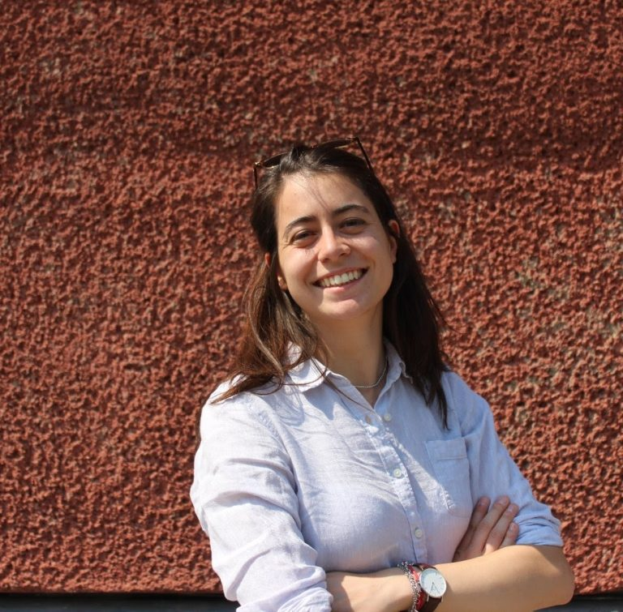
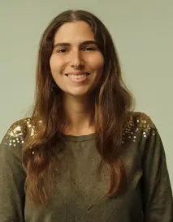
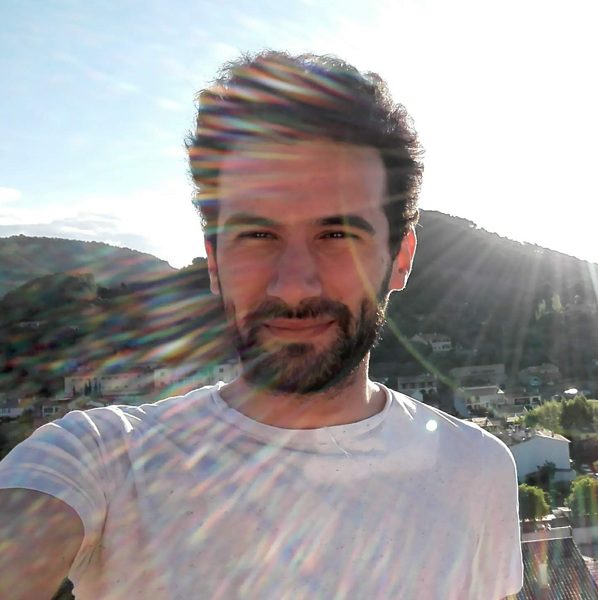
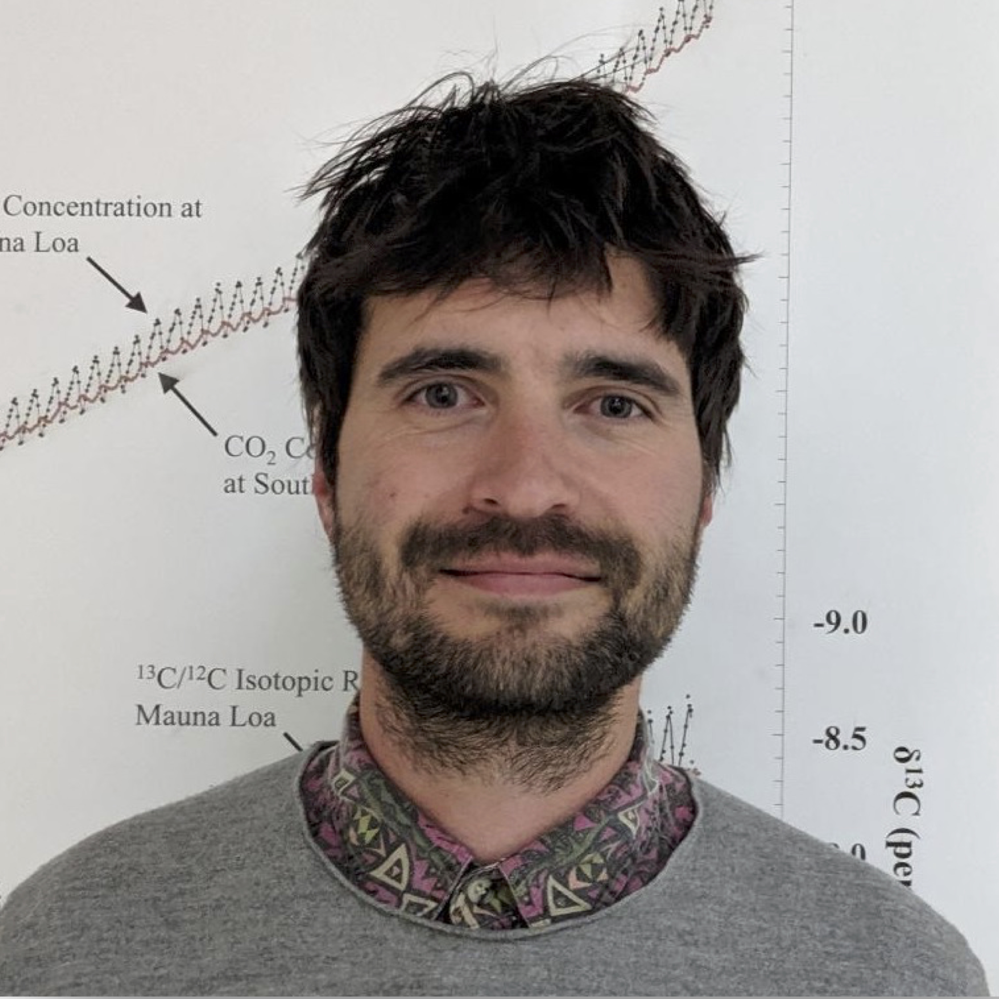
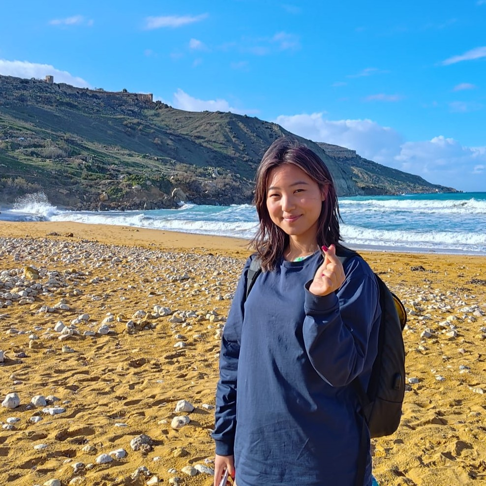
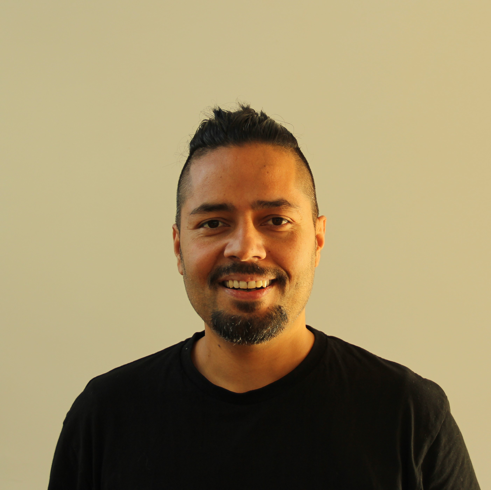
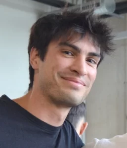
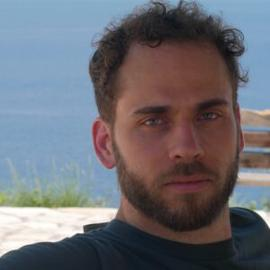
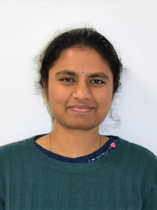

# Challenges

This repository serves as the central hub for all challenge material of the Winter School 2026 on **AI for Earth System, Hazards & Climate Extremes**.

Each challenge is hosted in a dedicated repository within this organization.  
All challenges are designed to be completed using **Google Colab**.

| # | Challenge Title | Repository | Tutors |
|---|-----------------|------------|--------|
| 01 | SeasFire: Deep Learning for Seasonal Wildfire danger Forecasting | [ch01-seasfire](https://github.com/WinterSchool2026/ch01-seasfire) | [Nikolas Papadopoulos](#nikolas-papadopoulos) |
| 02 | ML-based downscaling of future climate scenarios | [ch02-future-climate-downscaling](https://github.com/WinterSchool2026/ch02-future-climate-downscaling) | [Mikhail Ivanov](#mikhail-ivanov) |
| 03 | Using machine learning to assess ocean deoxygenation trends in space and time | [ch03-ml-ocean-deoxygenation](https://github.com/WinterSchool2026/ch03-ml-ocean-deoxygenation) | [Arianna Olivelli](#arianna-olivelli) |
| 04 | Hybrid modelling of land-atmosphere fluxes | [ch04-hybrid-land-atmosphere-fluxes](https://github.com/WinterSchool2026/ch04-hybrid-land-atmosphere-fluxes) | [Reda ElGhawi](#reda-elghawi) |
| 05 | Enhancing Earth System Modelling with Artificial Intelligence: Emulators vs Hybrid Models | [ch05-ai-esm-emulation-hybrid](https://github.com/WinterSchool2026/ch05-ai-esm-emulation-hybrid) | [Said Ouala](#said-ouala) |
| 06 | Can vegetation buffer meteorological extremes events? | [ch06-vegetation-buffering-extremes](https://github.com/WinterSchool2026/ch06-vegetation-buffering-extremes) | [Alexander Winkler](#alexander-winkler) |
| 07 | Seeing the spread: Visualizing spatiotemporal uncertainty in ensemble data | [ch07-spatiotemporal-uncertainty-ensembles](https://github.com/WinterSchool2026/ch07-spatiotemporal-uncertainty-ensembles) | [Fangfei "Fei" Lan](#fangfei-fei-lan) |
| 08 | Hybrid modelling for parameters of vegetation productivity in land models | [ch08-hybrid-vegetation-productivity](https://github.com/WinterSchool2026/ch08-hybrid-vegetation-productivity) | [Sujan Koirala](#sujan-koirala) |
| 09 | Causal Inference for Extreme Events | [ch09-causal-inference-extremes](https://github.com/WinterSchool2026/ch09-causal-inference-extremes) | [Marta Sapena](#marta-sapena) |
| 10 | Generating 3D video of hurricanes | [ch10-3d-hurricane-generation](https://github.com/WinterSchool2026/ch10-3d-hurricane-generation) | [Emiliano Díaz Salas-Porras](#emiliano-díaz-salas-porras) |
| 11 | Machine Learning for the Attribution of Extreme Events | [ch11-ml-attribution-extremes](https://github.com/WinterSchool2026/ch11-ml-attribution-extremes) | [Homer Durand](#homer-durand) |
| 12 | Lightweight Vision-Language Mixture-of-Experts for Interpretable Multispectral Satellite Representation Learning | [ch12-vlm-moe-multispectral](https://github.com/WinterSchool2026/ch12-vlm-moe-multispectral) | [Mohanad Albughdadi](#mohanad-albughdadi) |
| 13 | Identifiability in hybrid AI models for understanding flood extremes | [ch13-hybrid-ai-flood-extremes](https://github.com/WinterSchool2026/ch13-hybrid-ai-flood-extremes) | [Shijie Jiang](#shijie-jiang) |
| 14 | Multi-modal learning for Impact-based forecasting of Droughts in Eastern Africa | [ch14-multimodal-drought-forecasting](https://github.com/WinterSchool2026/ch14-multimodal-drought-forecasting) | [Vitus Benson](#vitus-benson) |
| 15 | Generative models for Interferometric Synthetic Aperture Radar | [ch15-generative-insar](https://github.com/WinterSchool2026/ch15-generative-insar) | [Nikolaos-Ioannis Bountos](#nikolaos-ioannis-bountos) |
| 16 | Vision-Language Models for EO: Connect imagery and text to enhance EO data interpretation | [ch16-vlm-earth-observation](https://github.com/WinterSchool2026/ch16-vlm-earth-observation) | [Angelos Zavras](#angelos-zavras) |
| 17 | Change retrieval in EO data using Vision Language Models (VLMs) | [ch17-vlm-change-retrieval](https://github.com/WinterSchool2026/ch17-vlm-change-retrieval) | [Valsamis (Makis) Ntouskos](#valsamis-makis-ntouskos) |
| 18 | The Multi-Modal ARD Factory: Mastering the Data-Centric Pipeline for EO Foundation Models | [ch18-multimodal-ard-factory](https://github.com/WinterSchool2026/ch18-multimodal-ard-factory) | [Vasileios Tsironis](#vasileios-tsironis) |
| 19 | Mini Climate Emulation | [ch19-mini-climate-emulation](https://github.com/WinterSchool2026/ch19-mini-climate-emulation) | [Nathan Mankovich](#nathan-mankovich) |
| 20 | Deep Probabilistic Forecasting of Global Temperature Fields | [ch20-deep-probabilistic-temperature](https://github.com/WinterSchool2026/ch20-deep-probabilistic-temperature) | [Aishwarya Venkataramanan](#aishwarya-venkataramanan) |

## Meet the tutors

<table>
<tr>
<td width="180" valign="center">

</td>
<td valign="center">

### Nikolas Papadopoulos  
**Challenge 01 – SeasFire: Deep Learning for Seasonal Wildfire danger Forecasting**

Nikolas Papadopoulos is a PhD candidate on AI for extreme weather events at the National Technical University of Athens (NTUA). Combining his physics background with data-driven methods, his research bridges Earth system science and machine learning, with a focus on high socio-environmental impact problems. His past work includes deep learning methods for volcanic activity monitoring and subseasonal-to-seasonal wildfire danger forecasting.

</td>
</tr>
</table>

---

<table>
<tr>
<td width="180" valign="center">

</td>
<td valign="center">

### Mikhail Ivanov  
**Challenge 02 – ML-based downscaling of future climate scenarios**

Mikhail Ivanov is an Expert in Machine Learning for Climate Applications at the Swedish Meteorological and Hydrological Institute (SMHI), Rossby Centre, in Norrköping, Sweden. His work focuses on machine learning–based statistical downscaling of climate projections for Europe within the OptimESM consortium, ensemble generation using generative adversarial networks in collaboration with ECMWF, and detection of extreme weather events using data-driven methods.

</td>
</tr>
</table>

---

<table>
<tr>
<td width="180" valign="center">

</td>
<td valign="center">

### Arianna Olivelli  
**Challenge 03 – Using machine learning to assess ocean deoxygenation trends in space and time**

Arianna Olivelli is a chemical oceanographer and Postdoctoral Researcher in the Past, Present and Future Marine Climate Change group led by Peter Landschützer at the Flanders Marine Institute (VLIZ), Belgium. Her research focuses on the impacts of human activities on marine climate change, including carbon and oxygen cycles and environmental pollution from trace metals and plastics. She holds a PhD in Marine Isotope Geochemistry from Imperial College London and combines ocean biogeochemistry with data science and machine learning approaches. She is also active in science communication and outreach, promoting accessibility and diversity in STEM.

</td>
</tr>
</table>

---

<table>
<tr>
<td width="180" valign="center">

</td>
<td valign="center">

### Reda ElGhawi  
**Challenge 04 – Hybrid modelling of land-atmosphere fluxes**

Reda El Ghawi is a post-doc working on land–atmosphere interactions within the ICON-ESM framework,
focusing on improving the representation of water and carbon cycle processes from local to
global scales. Her work covers stomatal conductance, assimilation regulators, transpiration,
GPP, vegetation dynamics, carbon allocation, disturbances, and forest ageing and regrowth.
She uses a combination of perturbed parameter ensembles, hybrid modelling approaches, and
machine-learning parametrizations to diagnose structural model biases and enhance key
land-surface processes, particularly under changing environmental conditions.

</td>
</tr>
</table>

---

<table>
<tr>
<td width="180" valign="center">

</td>
<td valign="center">

### Said Ouala  
**Challenge 5 - Enhancing Earth System Modelling with Artificial Intelligence: Emulators vs Hybrid Models**

Said Ouala is a Tenure-Track Professor (Chaire Professeur Junior) at IMT Atlantique
and a research scientist at CNRS (UMR-6285) and the INRIA Odyssey team. Hresearch
focuses on combining data science, artificial intelligence, and
computational methods to advance Earth system modeling, with a focus on
developing new observational products, designing data assimilation techniques, and
building predictive models that integrate physical knowledge with machine learning.

</td>
</tr>
</table>

---

<table>
<tr>
<td width="180" valign="center">

</td>
<td valign="center">

### Alexander Winkler  
**Challenge 06 - Can vegetation buffer meteorological extremes events?**

Alex is an Earth system scientist at the Max Planck Institute for Biogeochemistry and a core member of the ELLIS Unit Jena. His research focuses on the interactions between the atmosphere and biosphere, particularly their role in climate feedbacks. After earning his PhD in Earth system modeling at the Max-Planck-Institute for Meteorology and the University of Hamburg in 2019, he worked within the CLICCS Cluster of Excellence. Since 2020, he has been part of the ERC Synergy Grant “USMILE” at the Max Planck Institute for Biogeochemistry, where he leads the “Atmosphere-Biosphere Coupling, Climate, and Causality” Research Group.

Alex uses models—from simple frameworks to advanced Earth system models—and machine learning to explore CO2, water, and energy exchanges between land and atmosphere. His work emphasizes causal inference and hybrid models, combining data-driven and mechanistic approaches to advance process understanding.

</td>
</tr>
</table>

---

<table>
<tr>
<td width="180" valign="center">

</td>
<td valign="center">

### Fangfei "Fei" Lan  
**Challenge 07 - Seeing the spread: Visualizing spatiotemporal uncertainty in ensemble data**

Fangfei (Fei) Lan is a postdoctoral researcher at the University of Lausanne, working with Dr. Tom Beucler on AI for climate science as part of AI4PEX. Her research focuses on evaluating machine learning-based hybrid Earth system models, and exploring novel methodologies, such as topological data analysis (TDA), to advance climate modeling and scientific discoveries. She earned her Ph.D. in Computing in 2024 from the Scientific Computing and Imaging (SCI) Institute at the University of Utah, advised by Dr. Bei Wang. Her doctoral work centered on TDA and scientific visualization, applying algebraic and computational topology to the analysis and visualization of high-dimensional scientific data. During her Ph.D., she was a visiting researcher in the immersive visualization group at Linköping University in Sweden, collaborating with Dr. Alexander Bock and Dr. Anders Ynnerman on visualization for astrophysics. She holds a Bachelor of Science in Mathematics and Computational Science from American University, where she was introduced to topology by applied mathematician Dr. Michael Robinson, whose mentorship sparked her path into TDA research.
Website: https://fei0324.github.io/

</td>
</tr>
</table>

---

<table>
<tr>
<td width="180" valign="center">

</td>
<td valign="center">

### Sujan Koirala  
**Challenge 08 - Hybrid modelling for parameters of vegetation productivity in land models**

Bio coming soon.

</td>
</tr>
</table>

---

<table>
<tr>
<td width="180" valign="center">

</td>
<td valign="center">

### Marta Sapena  
**Challenge 09 - Causal Inference for Extreme Events**

Marta Sapena holds a PhD in Geomatics Engineering. Specializing in remote sensing for urban
applications, she integrates spatial analysis with advanced statistical methods. Her interests
range from assessing disaster risk exposure, developing susceptibility maps, and optimizing
population disaggregation techniques, to monitoring urban dynamics. Currently, she focuses on predicting
the impacts of extreme weather events such as droughts and heatwaves.

</td>
</tr>
</table>

---

<table>
<tr>
<td width="180" valign="center">

</td>
<td valign="center">

### Emiliano Díaz Salas-Porras  
**Challenge 10 - Generating 3D video of hurricanes**

Emiliano is an assistant professor at the Department of Statistics and Operations Research at the University of Valencia. His interests lie in causal discovery, causal inference, machine learning, probability, and statistics. More specifically, his work focuses on integrating causal and probabilistic reasoning with statistical and machine learning models to advance Earth System science. Methodologically, he has worked with and developed causal discovery approaches, including asymmetry-based bivariate causal discovery, invariant causal prediction, and convergent cross mapping.

</td>
</tr>
</table>

---

<table>
<tr>
<td width="180" valign="center">

</td>
<td valign="center">

### Homer Durand  
**Challenge 11 - Machine Learning for the Attribution of Extreme Events**

Homer Durand is a PhD student in remote sensing at the University of València with a background in computer science and applied mathematics. His research focuses on developing and understanding Detection and Attribution (D&A) of Climate Change methods in a causal inference framework. More broadly, he is interested in learning theory and how to combine different sources of data and knowledge to make predictions and understand complex phenomena. His academic interests also span causal inference (and its relationship with invariance and robustness), Bayesian inference, kernel methods and climate change D&A.

</td>
</tr>
</table>

---

<table>
<tr>
<td width="180" valign="center">

</td>
<td valign="center">

### Mohanad Albughdadi  
**Challenge 12 - Lightweight Vision-Language Mixture-of-Experts for Interpretable Multispectral Satellite Representation Learning**

Mohanad Albughdadi (https://albughdadim.github.io/) holds a PhD in Applied Mathematics (Toulouse, 2016) and is a Machine Learning Scientist at the European Centre for Medium-Range Weather Forecasts (ECMWF). He has over a decade of experience applying machine learning and cloud-based technologies to satellite imagery for environmental monitoring, agriculture, and land-management applications. His work spans methodological innovation, large-scale system development, and contributions to training, supervision, and scientific publications.

</td>
</tr>
</table>

---

<table>
<tr>
<td width="180" valign="center">

</td>
<td valign="center">

### Shijie Jiang  
**Challenge 13 - Identifiability in hybrid AI models for understanding flood extremes**

Shijie Jiang is a Project Group Leader in Machine Learning for Hydrological and Earth Systems. His research focuses on coupled water, energy, and carbon dynamics in hydrological, ecological, and climate systems, with an emphasis on integrating data and domain knowledge with hybrid and explainable machine learning.  

</td>
</tr>
</table>

---

<table>
<tr>
<td width="180" valign="center">

</td>
<td valign="center">

### Vitus Benson  
**Challenge 14 - Multi-modal learning for Impact-based forecasting of Droughts in Eastern Africa**

Vitus is an ELLIS PhD Student at the Max Planck Institute for Biogeochemistry and ETH
Zürich, as part of the EarthNet team (www.earthnet.tech). His work focuses on the
application of large deep neural networks to data of the Earth system, especially the
terrestrial biosphere. He coordinates the MPI BGC contribution to the WeatherGenerator
Horizon Europe project, co-leads the community effort AI4Carbon, is a RISKKAN working
group chair on AI for complex climate risk mitigation and is a frequent speaker at Red Cross
dialogue platforms on Anticipatory Action.

</td>
</tr>
</table>

---

<table>
<tr>
<td width="180" valign="center">

</td>
<td valign="center">

### Nikolaos-Ioannis Bountos  
**Challenge 15 - Generative models for Interferometric Synthetic Aperture Radar**

Dr. Bountos Nikolaos Ioannis was born in 1993 in Corfu, Greece. He holds a PhD in
Computer Science completed jointly between Orion Lab of the National Technical University
of Athens and Harokopio University of Athens. Additionally he holds a Master of Science
from the Technical University of Munich in Data Engineering and Analytics, and a Bachelor
of Science in Computer Science from the Aristotle University of Thessaloniki. His research
interests include deep learning, computer vision and Earth observation.
He has authored publications in top-tier machine learning conferences such as NeurIPS,
ICCV, and AAAI, as well as leading Earth Observation journals including IEEE Transactions
on Geoscience and Remote Sensing and IEEE Geoscience and Remote Sensing Letters. He
has extensive experience collaborating with leading research institutions, having completed
research stays at organizations such as Mila – Quebec AI Institute and the AI4EO Future
Lab of the Technical University of Munich. Part of his work was recognized among the Top
100 AI Projects of 2022–23 by UNESCO’s International Research Centre on Artificial
Intelligence (IRCAI).

</td>
</tr>
</table>

---

<table>
<tr>
<td width="180" valign="center">

</td>
<td valign="center">

### Angelos Zavras  
**Challenge 16 - Vision-Language Models for EO: Connect imagery and text to enhance EO data interpretation**

Angelos Zavras is currently enrolled as a PhD candidate at the Harokopio University of
Athens. He is also affiliated with the OrionLab research group, which is associated with the
Remote Sensing Lab of the National Technical University of Athens (NTUA) and the National
Observatory of Athens (NOA). He holds a BSc in Informatics and Telematics from the
Harokopio University of Athens and a MSc from the joint master’s program in Data Science
from the Institute of Informatics & Telecommunications of the National Centre for Scientific
Research Demokritos and the Department of Informatics & Telecommunications of the
University of Peloponnese. In the past he was involved for several years in the European
Space Agency’s (ESA) Copernicus programme, initially as a DevOps Engineer and later as
the Lead Copernicus Sentinels Data Access Operations Engineer of the Greek node of
European Space Agency Hubs at the Institute for Astronomy, Astrophysics, Space
Applications and Remote Sensing (IAASARS) of the National Observatory of Athens.

</td>
</tr>
</table>

---

<table>
<tr>
<td width="180" valign="center">

</td>
<td valign="center">

### Valsamis (Makis) Ntouskos  
**Challenge 17 - Change retrieval in EO data using Vision Language Models (VLMs)**

Valsamis (Makis) Ntouskos received the Engineering Diploma degree from the School of Rural and Surveying Engineering, National Technical University of Athens (NTUA), Greece, the B.Sc. degree in electronics engineering and the M.S.E. degree in artificial intelligence and robotics from Sapienza University of Rome, Sapienza, Italy, in 2010 and 2012, respectively, and the Ph.D. degree (Hons.) in computer engineering from Sapienza University, in 2016, working on ‘‘Inverse Problems Theory in Shape and Action Modeling.’’ From 2017 to 2020, he was a Researcher with the Department of Computer, Control, and Management Engineering, Sapienza, and a Research Fellow with the Remote Sensing Laboratory, NTUA, in 2020. Currently, he is an Associate Professor with Universitas Mercatorum, Italy. He has several publications in top-tier international conferences and journals in the fields of machine learning and computer vision. He serves as a program committee member and a reviewer for top-rank international conferences and journals in his field.

</td>
</tr>
</table>

---

<table>
<tr>
<td width="180" valign="center">

</td>
<td valign="center">

### Vasileios Tsironis  
**Challenge 18 - The Multi-Modal ARD Factory: Mastering the Data-Centric Pipeline for EO Foundation Models**

Vasileios Tsironis obtained his five-year Diploma (Intergrated Master) of Rural, Surveying and Geoinformatics Engineering in 2015 and his Postgraduate Master’s Diploma in ‘Mathematical modelling in modern technologies and financial engineering’ in 2017, from the National Technical University of Athens.Since October 2018 he has been a PhD candidate at the same university with a dissertation entitled “Deep Learning techniques for Big EO Data analytics”. Through his academic career and participation in several research and industrial projects, he has developed an extensive expertise in Earth Observation, Big Data analytics and Deep Learning applications with a focus on AI-based solutions development for EO projects, multi-modal and multi-scale EO data modelling, AI-powered EO insights and custom EO-based mapping products derivation. Also, through his career in the private sector, he has developed expert skills in programming, deep learning frameworks exploitation and CI/CD practices for MLOps in a containerized and distributed environment. 

</td>
</tr>
</table>

---

<table>
<tr>
<td width="180" valign="center">

</td>
<td valign="center">

### Nathan Mankovich  
**Challenge 19 - Mini Climate Emulation**

Nathan (Nate) Mankovich has a PhD in mathematics and is a Postdoctoral Researcher in the Image Processing Laboratory at the University of Valencia under Gustau Camps-Valls. His current research is on dynamic mode decomposition, flag manifolds for modern data analysis, and dimensionality reduction. He also works with climate models, developing data-driven methods for understanding climate variability and the forced response.

</td>
</tr>
</table>

---

<table>
<tr>
<td width="180" valign="center">

</td>
<td valign="center">

### Aishwarya Venkataramanan  
**Challenge 20 - Deep Probabilistic Forecasting of Global Temperature Fields**

Bio coming soon.

</td>
</tr>
</table>

## Support

Questions regarding a specific challenge should be directed to the tutors listed in the respective repository.

For general organizational questions, please contact:
- npapadopoulos@mail.ntua.gr
- georgios.athanasiou.ntua@gmail.com
