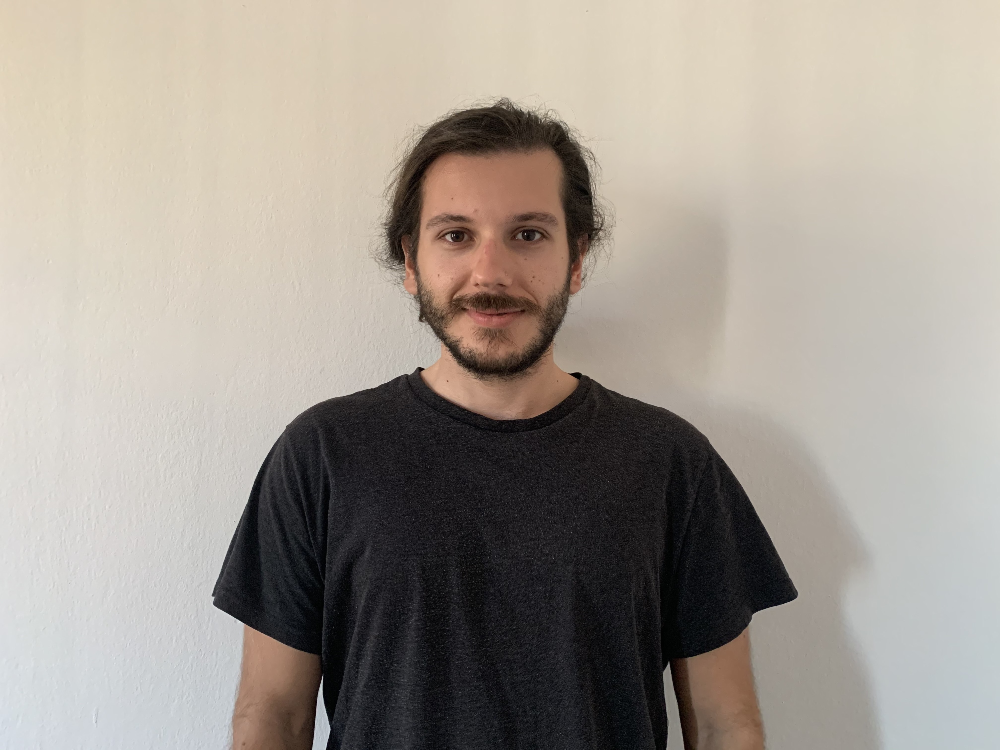
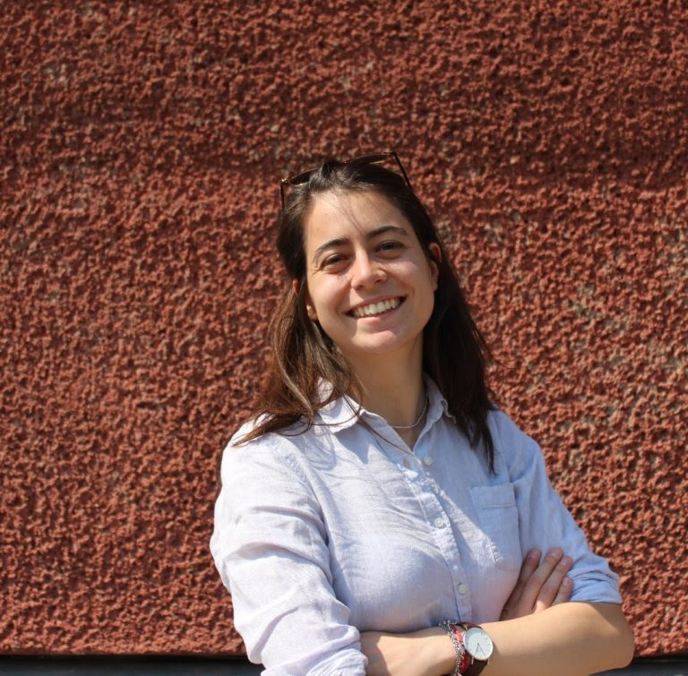
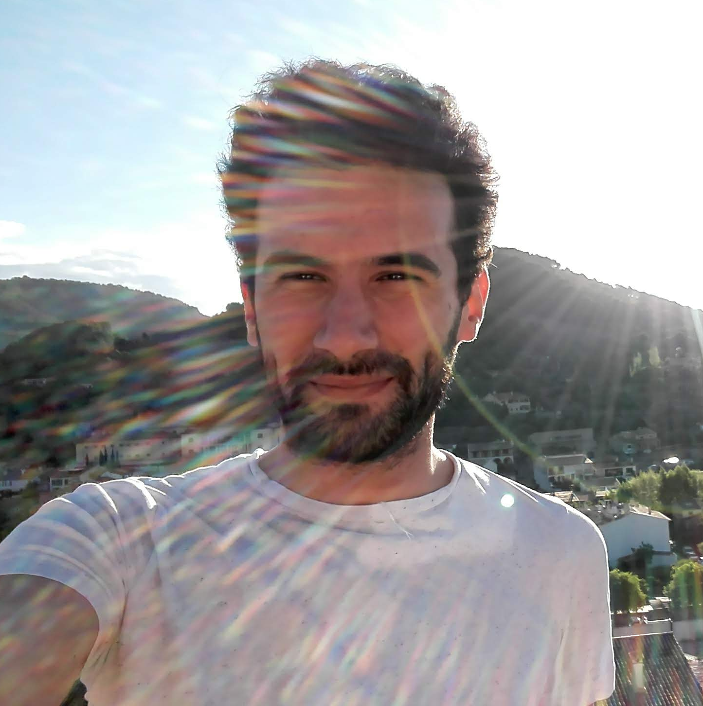
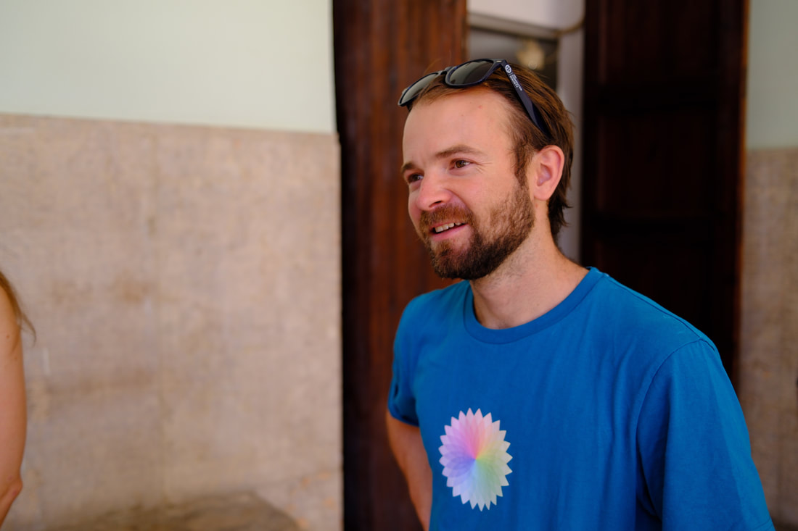
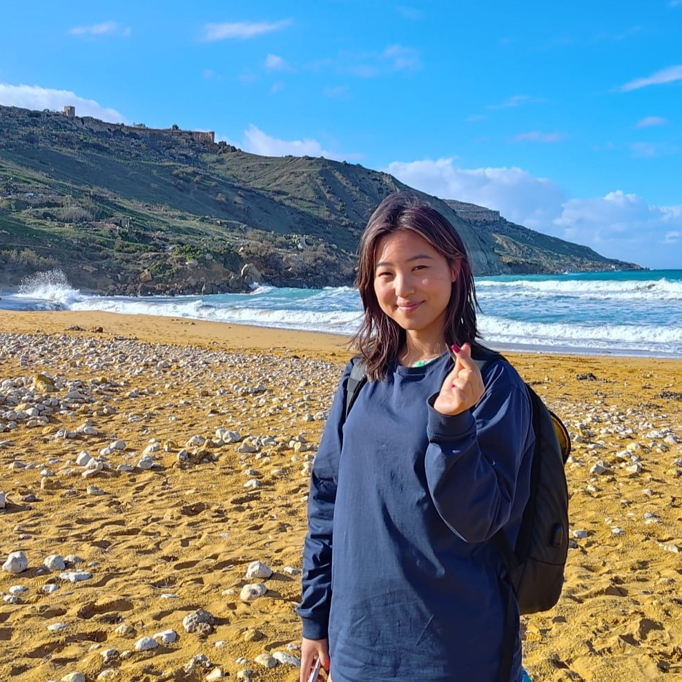
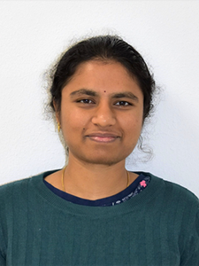
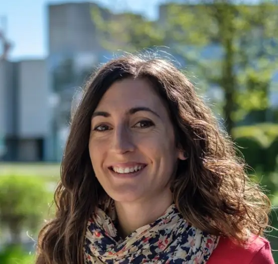
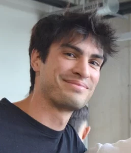

# Challenges

This repository serves as the central hub for all challenge material of the Winter School 2026 on **AI for Earth System, Hazards & Climate Extremes**.

Each challenge is hosted in a dedicated repository within this organization.  
All challenges are designed to be completed using **Google Colab**.

| # | Challenge Title | Repository | Tutors |
|---|-----------------|------------|--------|
| CH-01 | [SeasFire: Deep Learning for Seasonal Wildfire danger Forecasting](#challenge-01) | [ch01-seasfire](https://github.com/WinterSchool2026/ch01-seasfire) | [Nikolas Papadopoulos](#nikolas-papadopoulos) |
| CH-02 | [ML-based downscaling of future climate scenarios](#challenge-02) | [ch02-future-climate-downscaling](https://github.com/WinterSchool2026/ch02-future-climate-downscaling) | [Mikhail Ivanov](#mikhail-ivanov) |
| CH-03 | [Using machine learning to assess ocean deoxygenation trends in space and time](#challenge-03) | [ch03-ml-ocean-deoxygenation](https://github.com/WinterSchool2026/ch03-ml-ocean-deoxygenation) | [Arianna Olivelli](#arianna-olivelli) |
| CH-04 | [Hybrid modelling of land-atmosphere fluxes](#challenge-04) | [ch04-hybrid-land-atmosphere-fluxes](https://github.com/WinterSchool2026/ch04-hybrid-land-atmosphere-fluxes) | [Reda ElGhawi](#reda-elghawi) & [Sujan Koirala](#sujan-koirala) |
| CH-05 | [Enhancing Earth System Modelling with Artificial Intelligence: Emulators vs Hybrid Models](#challenge-05) | [ch05-ai-esm-emulation-hybrid](https://github.com/WinterSchool2026/ch05-ai-esm-emulation-hybrid) | [Said Ouala](#said-ouala) |
| CH-06 | [Mini Climate Emulation](#challenge-06) | [ch06-mini-climate-emulation](https://github.com/WinterSchool2026/ch06-mini-climate-emulation) | [Nathan Mankovich](#nathan-mankovich) |
| CH-07 | [Seeing the spread: Visualizing spatiotemporal uncertainty in ensemble data](#challenge-07) | [ch07-spatiotemporal-uncertainty-ensembles](https://github.com/WinterSchool2026/ch07-spatiotemporal-uncertainty-ensembles) | [Fangfei "Fei" Lan](#fangfei-fei-lan) |
| CH-08 | [Deep Probabilistic Forecasting of Global Temperature Fields](#challenge-08) | [ch08-deep-probabilistic-temperature](https://github.com/WinterSchool2026/ch08-deep-probabilistic-temperature) | [Aishwarya Venkataramanan](#aishwarya-venkataramanan) |
| CH-09 | [Causal Inference for Extreme Events](#challenge-09) | [ch09-causal-inference-extremes](https://github.com/WinterSchool2026/ch09-causal-inference-extremes) | [Marta Sapena](#marta-sapena) |
| CH-10 | [Generating 3D video of hurricanes](#challenge-10) | [ch10-3d-hurricane-generation](https://github.com/WinterSchool2026/ch10-3d-hurricane-generation) | [Emiliano Díaz Salas-Porras](#emiliano-díaz-salas-porras) |
| CH-11 | [Machine Learning for the Attribution of Extreme Events](#challenge-11) | [ch11-ml-attribution-extremes](https://github.com/WinterSchool2026/ch11-ml-attribution-extremes) | [Homer Durand](#homer-durand) |
| CH-12 | [Lightweight Vision-Language Mixture-of-Experts for Interpretable Multispectral Satellite Representation Learning](#challenge-12) | [ch12-vlm-moe-multispectral](https://github.com/WinterSchool2026/ch12-vlm-moe-multispectral) | [Mohanad Albughdadi](#mohanad-albughdadi) |
| CH-13 | [Identifiability in hybrid AI models for understanding flood extremes](#challenge-13) | [ch13-hybrid-ai-flood-extremes](https://github.com/WinterSchool2026/ch13-hybrid-ai-flood-extremes) | [Shijie Jiang](#shijie-jiang) |
| CH-14 | [Multi-modal learning for Impact-based forecasting of Droughts in Eastern Africa](#challenge-14) | [ch14-multimodal-drought-forecasting](https://github.com/WinterSchool2026/ch14-multimodal-drought-forecasting) | [Vitus Benson](#vitus-benson) |
| CH-15 | [Generative models for Interferometric Synthetic Aperture Radar](#challenge-15) | [ch15-generative-insar](https://github.com/WinterSchool2026/ch15-generative-insar) | [Nikolaos-Ioannis Bountos](#nikolaos-ioannis-bountos) |
| CH-16 | [Vision-Language Models for EO: Connect imagery and text to enhance EO data interpretation](#challenge-16) | [ch16-vlm-earth-observation](https://github.com/WinterSchool2026/ch16-vlm-earth-observation) | [Angelos Zavras](#angelos-zavras) |
| CH-17 | [Change retrieval in EO data using Vision Language Models (VLMs)](#challenge-17) | [ch17-vlm-change-retrieval](https://github.com/WinterSchool2026/ch17-vlm-change-retrieval) | [Valsamis (Makis) Ntouskos](#valsamis-makis-ntouskos) |
| CH-18 | [The Multi-Modal ARD Factory: Mastering the Data-Centric Pipeline for EO Foundation Models](#challenge-18) | [ch18-multimodal-ard-factory](https://github.com/WinterSchool2026/ch18-multimodal-ard-factory) | [Vasileios Tsironis](#vasileios-tsironis) |
| CH-19 | [Learning global parameterizations of ecosystem processes using hybrid modelling](#challenge-19) | [ch19-global-ecosystem-hybrid-parameterization](https://github.com/WinterSchool2026/ch19-global-ecosystem-hybrid-parameterization) | [Xu Shan](#xu-shan) |
| CH-20 | [Can vegetation buffer meteorological extremes events?](#challenge-20) | [ch20-vegetation-buffer-meteo-extremes](https://github.com/WinterSchool2026/ch20-vegetation-buffer-meteo-extremes) | [Alexander Wrinkler](#alexander-wrinkler) |

## Participant/Tutor Support
Questions regarding a specific challenge should be directed to the tutors listed in the respective repository.

For general organizational questions, please contact:
- georgios.athanasiou.ntua@gmail.com

## Challenge Descriptions
### CH-01 – SeasFire: Deep Learning for Seasonal Wildfire danger Forecasting

Tutor(s): [Nikolas Papadopoulos](#nikolas-papadopoulos)  
Repository: [ch01-seasfire](https://github.com/WinterSchool2026/ch01-seasfire)

**Overview:**
Wildfires are a growing global threat, impacting ecosystems, economies, and human livelihoods. While short-term wildfire predictions often leverage local weather conditions, forecasting fire activity weeks to months in advance remains a challenge due to the complex interplay of climate, vegetation dynamics, land surface processes, and human activities.

This challenge focuses on subseasonal to seasonal wildfire forecasting using the SeasFire datacube — a comprehensive spatiotemporal dataset designed for long-lead wildfire modeling.

Participants are invited to explore the dataset and develop data-driven models to improve our understanding and prediction of wildfire dynamics at extended lead times.

### CH-02 – ML-based downscaling of future climate scenarios

Tutor(s): [Mikhail Ivanov](#mikhail-ivanov)  
Repository: [ch02-future-climate-downscaling](https://github.com/WinterSchool2026/ch02-future-climate-downscaling)

**Overview:**
Global circulation and Earth system models may capture the impact of greenhouse emissions on the world climate and the occurrence of tipping points. However, their spatial resolution is often too coarse to capture the local effects, particularly the extent of extreme events such as heatwaves, droughts, and extreme precipitation. The dynamical downscaling, where the region of interest is simulated at a higher resolution and the boundaries are forced by a global model, is one of the options to assess the effects of climate change at a regional scale. Yet, the high computational cost of the regional models limits the number of selected regions and ensemble members. In this challenge, we are going to explore the ML-based alternatives to dynamical downscaling, where a ML-model learns the high-resolution mapping from reanalysis or climate model data, and then used to downscale a future scenario for high-resolution insights into the new climate and extreme events.

### CH-03 – Using machine learning to assess ocean deoxygenation trends in space and time

 
Tutor(s): [Arianna Olivelli](#arianna-olivelli)  
Repository: [ch03-ml-ocean-deoxygenation](https://github.com/WinterSchool2026/ch03-ml-ocean-deoxygenation)

**Overview:**
In this challenge, participants will be tasked with adapting currently available
machine learning models to assess global and regional trends of ocean deoxygenation, as
well as identify their potential drivers and effects on the ecosystem. In situ measurements of
O2 will be provided from the BGC-Argo and GLODAPv2 datasets, together with the
backbone of the code to use as starting point. Key questions to explore include:

- How would increasing or decreasing the number of observations as well as changing
sampling locations affect the mapped output and, therefore, the estimated deoxygenation
trends?
- How does increasing the spatiotemporal resolution of the gridded product affect
estimates of deoxygenation trends on a regional scale?

Through this project, we aim to gain a deeper understanding on how (i) sample distribution
biases model output, and how this information can be used in uncertainty quantification and
(ii) different gridded-product resolutions affect mapped O2 variability and deoxygenation
trends. This challenge can possibly be extended beyond the duration of the summer school.

### CH-04 – Hybrid modelling of land-atmosphere fluxes

Tutor(s): [Reda ElGhawi](#reda-elghawi) & [Sujan Koirala](#sujan-koirala)  
Repository: [ch04-hybrid-land-atmosphere-fluxes](https://github.com/WinterSchool2026/ch04-hybrid-land-atmosphere-fluxes)

**Overview:**
This challenge introduces participants to hybrid modelling approaches for improving land–
atmosphere fluxes in ICON-ESM. Students will explore stomatal conductance, transpiration,
and GPP at selected FLUXNET sites using a combination of ICON-JSBACH4 (Fortran)
simulations and feed-forward neural network (FNN) hybrid model implemented in Python.
Across three sessions, participants will (1) run and analyse baseline ICON simulations for localized FLUXNET sites, (2) train and evaluate a hybrid model, and (3) implement the pretrained hybrid model in ICON. The challenge is open-ended: groups evaluate whether the
hybrid approach improves model performance, under which conditions it succeeds or fails,
and how such ML–physics combinations could influence land-surface modelling especially
under changing environmental conditions.

### CH-05 – Enhancing Earth System Modelling with Artificial Intelligence: Emulators vs Hybrid Models

Tutor(s): [Said Ouala](#said-ouala)  
Repository: [ch05-ai-esm-emulation-hybrid](https://github.com/WinterSchool2026/ch05-ai-esm-emulation-hybrid)

**Overview:**
In this challenge, students are provided with a reference simulation from an idealized ocean model. The goal is to reproduce this simulation using one of these approaches:
- A deep-learning–based emulator,
- A hybrid scheme combining a coarse-resolution ocean model with a learned correction term

### CH-06 – Mini Climate Emulation

Tutor(s): [Nathan Mankovich](#nathan-mankovich)  
Repository: [ch06-mini-climate-emulation](https://github.com/WinterSchool2026/ch06-mini-climate-emulation)

**Overview:**
Full climate simulations are computationally expensive, so fast, physically consistent emulators are essential. The Mini Climate Emulation Challenge invites participants to build ML emulators for daily, coarse-resolution NORESM2-MM output. Participants will predict climate indices for extreme events using input aerosol and greenhouse gas datasets, along with historical climate simulations.

### CH-07 – Seeing the spread: Visualizing spatiotemporal uncertainty in ensemble data

Tutor(s): [Fangfei "Fei" Lan](#fangfei-fei-lan)  
Repository: [ch07-spatiotemporal-uncertainty-ensembles](https://github.com/WinterSchool2026/ch07-spatiotemporal-uncertainty-ensembles)

**Overview:**
Ensemble forecasting is a cornerstone of modern weather and climate prediction. Rather than producing a single deterministic forecast, ensemble models simulate many possible futures to reflect the inherent uncertainty of Earth system processes. Ensemble methods are often stronger predictors than individual model runs, and they reveal a range of plausible outcomes rather than a single best guess. This results in a high-dimensional, multivariate dataset with substantial spread and divergence across members.

Visualization plays a critical role in interpreting these ensembles, yet uncertainty is notoriously difficult to communicate effectively. Poorly designed visualizations can be confusing or even misleading. Increasingly, AI and machine-learning methods are being integrated into ensemble analysis, such as clustering, dimensionality reduction, or pattern extraction, to help reveal dominant structures, regimes, or anomalies in complex forecast datasets.

In this challenge, you will explore ensemble output from the Global Ensemble Forecast System (GEFS) and examine how uncertainty evolves across space, time, and variables. You will receive a subset of GEFS forecasts for a recent high-impact weather event and experiment with visualization techniques to reveal the structure and behavior of the ensemble from both spatial and temporal perspectives.

Your goal is to collaboratively explore uncertainty in real-world data and apply uncertainty visualization techniques to make sense of an evolving ensemble forecast.

### CH-08 – Deep Probabilistic Forecasting of Global Temperature Fields

Tutor(s): [Aishwarya Venkataramanan](#aishwarya-venkataramanan)  
Repository: [ch08-deep-probabilistic-temperature](https://github.com/WinterSchool2026/ch08-deep-probabilistic-temperature)

**Overview:**
In this challenge, students will use ERA5 reanalysis data to develop deep learning models that forecast monthly global temperature maps. The focus is on quantifying and analyzing predictive uncertainty, including aleatoric (data-related) and epistemic (model-related) components. Students will implement CNN/ConvLSTM architectures in PyTorch, explore probabilistic outputs, and evaluate their models using metrics such as RMSE, NLL, CRPS, and calibration diagrams, providing insights into spatial, temporal, and seasonal patterns of uncertainty.

### CH-09 – Causal Inference for Extreme Events

Tutor(s): [Marta Sapena](#marta-sapena)  
Repository: [ch09-causal-inference-extremes](https://github.com/WinterSchool2026/ch09-causal-inference-extremes)

**Overview:**
Droughts are hydroclimatic anomalies driven by precipitation deficits and increased evapotranspiration, posing an escalating threat under global warming conditions. However, assessing drought risk remains challenging due to the complex interactions between biophysical conditions and human systems, as well as limitations in impact reporting. Furthermore, the impact of drought varies significantly across different sectors because different types of drought affect socio-environmental systems in different ways. Therefore, an approach based on drought impacts is essential for understanding drought risk.

Although traditional machine learning (ML) has achieved remarkable success in drought prediction, these models are often based on spurious correlations rather than physical mechanisms. Predictive accuracy does not translate into causal understanding. In order to develop actionable policies for climate adaptation, we must transition from prediction based on associations to causal inference.

This challenge focuses on causal inference methods to identify the causes of extreme weather events. Participants will move beyond association in order to estimate the heterogeneous causal effect of climate and environmental factors on the severity of such events.

Participants are invited to explore the dataset and develop causal inference models to improve our understanding of the impact of drought on the agricultural sector.

### CH-10 – Generating 3D video of hurricanes

Tutor(s): [Emiliano Díaz Salas-Porras](#emiliano-díaz-salas-porras)  
Repository: [ch10-3d-hurricane-generation](https://github.com/WinterSchool2026/ch10-3d-hurricane-generation)

**Overview:**
Use deep learning to obtain 3D maps of hurricanes from multispectral 2d geostationary imagery. The goal is to use 2d satellite imagery as input and vertical profiles of clouds, consisting of radar/lidar from cloudsat, as output. Since cloudsat measurements are sparse in space and time (narrow swath with approximately monthly revisit time) , estimating vertical profiles from geostationary imagery allows for 15 minute cadence 3d maps. Although infra-red channels and spatial information contained in the 2d imagery include information on the vertical dimension, as shown by success of deep learning models in this task, not all the vertical information is available. This means that for a given 2d image it is more appropriate to produce a distribution of possible 3d cloud maps. The goal is to use generative techniques, such as latent diffusion, to address this challenge.

### CH-11 – Machine Learning for the Attribution of Extreme Events

Tutor(s): [Homer Durand](#homer-durand)  
Repository: [ch11-ml-attribution-extremes](https://github.com/WinterSchool2026/ch11-ml-attribution-extremes)

**Overview:**
Attributing climate extremes remains challenging for many variables, including precipitation, wind, and soil moisture. We aim to explore recent advances in machine learning for Earth system modelling—such as neural networks, causal inference methods, kernel methods, and Bayesian approaches—and apply them to strengthen existing attribution frameworks. Our focus is on improving the integration and quantification of the various sources of uncertainty.

### CH-12 – Lightweight Vision-Language Mixture-of-Experts for Interpretable Multispectral Satellite Representation Learning

Tutor(s): [Mohanad Albughdadi](#mohanad-albughdadi)  
Repository: [ch12-vlm-moe-multispectral](https://github.com/WinterSchool2026/ch12-vlm-moe-multispectral)

Overview:
Earth Observation imagery exhibits strong heterogeneity across land-cover classes, making it inefficient for a single compact model to represent all patterns equally well. Modern Earth Observation models increasingly rely on large opaque encoders to achieve strong performance. On the other hand, Mixture-of-Experts architectures promise computational efficiency and specialization. The conditional routing of these models enables different experts to specialize in distinct spectral-spatial regimes. However, their internal behavior remains poorly understood.
VLMs introduce a powerful new capability, which is the semantic alignment between visual features and natural language.
 In this challenge, participants will explore a lightweight metadata-aware Mixture-of-Experts Masked Autoencoder (Geo-MoE-MAE) pretrained on multispectral Landsat imagery. Building on this foundation, the group will develop a lightweight vision-language interface using existing multilabel annotations (i.e., BigEarthNet labels). 
The core idea is to convert these labels into text prompts and align image representations with a frozen lightweight language encoder. This will enable text-to-image retrieval, and produce spatially localized experts with semantically meaningful specialization, while remaining computationally efficient.
Practical steps:
  - Participants will combine:
      - A pretrained lightweight MoE-MAE vision encoder (patch-based, sparse experts),
      - A small text encoder,
      - The resulting model will be trained with contrastive VLM alignment (CLIP-style).
        
  - The resulting model to be analyzed through:
      - Routing: top-1 expert assignment for each patch.
      - Contribution: how strongly each expert influences each patch.
      - Ablation: how much the final representation changes when a specific expert is removed.
      - Expert naming: because image and text live in the same feature space, experts can be named by comparing expert-conditioned image embeddings to a small query bank of basic land cover classes.

The goal is to demonstrate how conditional routing and weak language supervision together provide an interpretable, resource-efficient representation model for optical remote sensing.

### CH-13 – Identifiability in hybrid AI models for understanding flood extremes

Tutor(s): [Shijie Jiang](#shijie-jiang)  
Repository: [ch13-hybrid-ai-flood-extremes](https://github.com/WinterSchool2026/ch13-hybrid-ai-flood-extremes)

**Overview:**
The challenge examines identifiability issues in hybrid models that link extreme rainfall to flood response across catchments. This problem is central yet often overlooked, and it sets a practical limit on how reliable and interpretable hybrid models can be. Using a concrete flood case study, participants will investigate when parameterizations become weakly identified, how this affects stability and scientific value, and, most importantly, which constraints or model structures can address these identifiability issues in practice.

### CH-14 – Multi-modal learning for Impact-based forecasting of Droughts in Eastern Africa

Tutor(s): [Vitus Benson](#vitus-benson)  
Repository: [ch14-multimodal-drought-forecasting](https://github.com/WinterSchool2026/ch14-multimodal-drought-forecasting)

**Overview:**
In this challenge, we are exploring deep learning algorithms for forecasting the impact of climate extremes on vegetation at high resolution. For this, we leverage an existing dataset of co-aligned Sentinel-2 satellite images and meteorological reanalysis: the DeepExtremeCubes. We will work with PyTorch and xarray and decide jointly what goals we want to achieve during the week 🙂

### CH-15 – Generative models for Interferometric Synthetic Aperture Radar

Tutor(s): [Nikolaos-Ioannis Bountos](#nikolaos-ioannis-bountos)  
Repository: [ch15-generative-insar](https://github.com/WinterSchool2026/ch15-generative-insar)

**Overview:**
Interferometric Synthetic Aperture Radar (InSAR) is a powerful remote sensing modality that can provide highly accurate information on ground displacement by examining the phase differences between Synthetic Aperture Radar acquisitions captured at different times on the same location. InSAR has become indispensable for monitoring earthquakes, volcanic activity, landslides, subsidence, and infrastructure stability. However, the limited frequency of such geophysical events results in scarce labeled datasets, hindering the application of deep learning methods in this high-impact domain. This challenge aims to address this problem through synthetic InSAR generation. The objectives of this challenge can be summarized as follows: a) Model Development: Design methods that can generate synthetic samples conditioned on predefined concepts or textual description of InSAR data; b) Evaluation Protocol: Construct an evaluation protocol that assesses the quality of the generated InSAR, taking into consideration both the generated image quality as well as the underlying physics; c) Practical utility assessment: Test whether synthetically generated InSAR can be used effectively as a training dataset for supervised learning.

### CH-16 – Vision-Language Models for EO: Connect imagery and text to enhance EO data interpretation

Tutor(s): [Angelos Zavras](#angelos-zavras)  
Repository: [ch16-vlm-earth-observation](https://github.com/WinterSchool2026/ch16-vlm-earth-observation)

**Overview:**
The Earth’s orbit is teeming with a growing constellation of Earth Observation (EO) satellites, continuously producing an unprecedented volume of diverse and complex information about our planet. In this data-rich landscape, language provides a natural interface to interact with and analyze these vast RS archives. The “Vision-Language Models for EO” Challenge invites participants to use pre-trained VLMs to interact with EO data through natural language. Possible directions include image captioning, visual question answering, EO data retrieval, or text-based image search.

### CH-17 – Change retrieval in EO data using Vision Language Models (VLMs)

Tutor(s): [Valsamis (Makis) Ntouskos](#valsamis-makis-ntouskos)  
Repository: [ch17-vlm-change-retrieval](https://github.com/WinterSchool2026/ch17-vlm-change-retrieval)

**Overview:**
Tasks:
- Generate and curate change captions using VLMs
- Evaluate change retrieval on EO data via text-to-image retrieval
- Localization of changes in EO data

### CH-18 – The Multi-Modal ARD Factory: Mastering the Data-Centric Pipeline for EO Foundation Models

Tutor(s): [Vasileios Tsironis](#vasileios-tsironis)  
Repository: [ch18-multimodal-ard-factory](https://github.com/WinterSchool2026/ch18-multimodal-ard-factory)

**Overview:**
This challenge tackles the "Data-Centric AI" bottleneck in Earth Observation: transforming heterogeneous satellite streams into Foundation-Model-ready data cubes. Participants will design an end-to-end pipeline to harmonize Sentinel-1 (SAR) and Sentinel-2/Landsat-9 (Optical) data. The work involves navigating physical corrections (RTC, atmospheric/spectral alignment) and solving dense co-registration puzzles using advanced methods like optical flow (e.g., GeFolki). Finally, groups will "prove" the quality of their ARD by analysing its impact on the embedding space of an EO Foundation Model, investigating how data-engineering choices directly influence AI reasoning for climate and hazard applications.

### CH-19 – Learning global parameterizations of ecosystem processes using hybrid modelling

Tutor(s): [Xu Shan](#xu-shan)  
Repository: [ch19-global-ecosystem-hybrid-parameterization](https://github.com/WinterSchool2026/ch19-global-ecosystem-hybrid-parameterization)

**Overview:**
Land carbon and water fluxes shape the feedback between terrestrial ecosystems and climate, yet traditional land models remain hampered by structural error and equifinality. Hybrid models—embedding machine learning (ML) modules inside mechanistic frameworks—address several of these gaps by combining physical consistency with data driven flexibility. So far, pioneering work linking process knowledge and ML has already demonstrated superior realism across scales, while underlining the need for richer observations to resolve coupled C–H₂O dynamics. This is demonstrated by the limitation in learning the spatial and temporal controls of parameters that modulate the responses of ecosystems to weather and climate variability.The challenge lies in the need for intensive and long-term observations that underpin robust and comprehensive representations of ecosystem functioning. Although hundreds of locations with such observations exist worldwide, we still observe significant limitations in parameter generalization, consequently limiting our ability to predict ecosystem function. The challenge here is to overcome the previous generalizability in predicting carbon and water fluxes using a hybrid modelling approach. Based on a global open dataset and the SINDBAD hybrid modelling framework, the project will be open to a wide range of approaches towards generalization, from different ML architectures to the ingestion of foundation models.

### CH-20 – Can vegetation buffer meteorological extremes events?

Tutor(s): [Alexander Wrinkler](#alexander-wrinkler)  
Repository: [ch20-vegetation-buffer-meteo-extremes](https://github.com/WinterSchool2026/ch20-vegetation-buffer-meteo-extremes)

**Overview:**
Explore high-resolution climate
model simulations of historical climate extreme analogs under different ecosystem and land
states. Reveal the importance of plants and ecosystems in modulating the climate
extremes!

## Meet the tutors

<table>
<tr>
<td width="180" valign="center">

</td>
<td valign="center">

### Georgios Athanasiou 
**Scientific Coordinator**

Georgios Athanasiou is a postdoctoral researcher at the Remote Sensing Lab of NTUA, working at the intersection of AI, Earth Observation, and causal machine learning. He holds a PhD in Artificial Intelligence for Assisted Reproduction and has extensive experience in deep learning for medical imaging. His past experience includes applied artificial intelligence research across healthcare, biotechnology, and environmental domains, with a focus on developing robust machine learning systems for real-world impact.

</td>
</tr>
</table>

---

<table>
<tr>
<td width="180" valign="center">

</td>
<td valign="center">

### Nikolas Papadopoulos  
**Challenge 01 – SeasFire: Deep Learning for Seasonal Wildfire danger Forecasting**

Nikolas Papadopoulos is a PhD candidate on AI for extreme weather events at the National Technical University of Athens (NTUA). Combining his physics background with data-driven methods, his research bridges Earth system science and machine learning, with a focus on high socio-environmental impact problems. His past work includes deep learning methods for volcanic activity monitoring and subseasonal-to-seasonal wildfire danger forecasting.

</td>
</tr>
</table>

---

<table>
<tr>
<td width="180" valign="center">

</td>
<td valign="center">

### Mikhail Ivanov  
**Challenge 02 – ML-based downscaling of future climate scenarios**

Mikhail Ivanov is an Expert in Machine Learning for Climate Applications at the Swedish Meteorological and Hydrological Institute (SMHI), Rossby Centre, in Norrköping, Sweden. His work focuses on machine learning–based statistical downscaling of climate projections for Europe within the OptimESM consortium, ensemble generation using generative adversarial networks in collaboration with ECMWF, and detection of extreme weather events using data-driven methods.

</td>
</tr>
</table>

---

<table>
<tr>
<td width="180" valign="center">

</td>
<td valign="center">

### Arianna Olivelli  
**Challenge 03 – Using machine learning to assess ocean deoxygenation trends in space and time**

Arianna Olivelli is a chemical oceanographer and Postdoctoral Researcher in the Past, Present and Future Marine Climate Change group led by Peter Landschützer at the Flanders Marine Institute (VLIZ), Belgium. Her research focuses on the impacts of human activities on marine climate change, including carbon and oxygen cycles and environmental pollution from trace metals and plastics. She holds a PhD in Marine Isotope Geochemistry from Imperial College London and combines ocean biogeochemistry with data science and machine learning approaches. She is also active in science communication and outreach, promoting accessibility and diversity in STEM.

</td>
</tr>
</table>

---

<table>
<tr>
<td width="180" valign="center">

</td>
<td valign="center">

### Reda ElGhawi  
**Challenge 04 – Hybrid modelling of land-atmosphere fluxes**

Reda El Ghawi is a post-doc working on land–atmosphere interactions within the ICON-ESM framework,
focusing on improving the representation of water and carbon cycle processes from local to
global scales. Her work covers stomatal conductance, assimilation regulators, transpiration,
GPP, vegetation dynamics, carbon allocation, disturbances, and forest ageing and regrowth.
She uses a combination of perturbed parameter ensembles, hybrid modelling approaches, and
machine-learning parametrizations to diagnose structural model biases and enhance key
land-surface processes, particularly under changing environmental conditions.

</td>
</tr>
</table>

---

<table>
<tr>
<td width="180" valign="center">

</td>
<td valign="center">

### Sujan Koirala  
**Challenge 04 – Hybrid modelling of land-atmosphere fluxes**

Bio coming soon.

</td>
</tr>
</table>

---

<table>
<tr>
<td width="180" valign="center">

</td>
<td valign="center">

### Said Ouala  
**Challenge 5 - Enhancing Earth System Modelling with Artificial Intelligence: Emulators vs Hybrid Models**

Said Ouala is a Tenure-Track Professor (Chaire Professeur Junior) at IMT Atlantique
and a research scientist at CNRS (UMR-6285) and the INRIA Odyssey team. Hresearch
focuses on combining data science, artificial intelligence, and
computational methods to advance Earth system modeling, with a focus on
developing new observational products, designing data assimilation techniques, and
building predictive models that integrate physical knowledge with machine learning.

</td>
</tr>
</table>

---

<table>
<tr>
<td width="180" valign="center">

</td>
<td valign="center">

### Nathan Mankovich  
**Challenge 06 - Mini Climate Emulation**

Nathan (Nate) Mankovich has a PhD in mathematics and is a Postdoctoral Researcher in the Image Processing Laboratory at the University of Valencia under Gustau Camps-Valls. His current research is on dynamic mode decomposition, flag manifolds for modern data analysis, and dimensionality reduction. He also works with climate models, developing data-driven methods for understanding climate variability and the forced response.

</td>
</tr>
</table>

---

<table>
<tr>
<td width="180" valign="center">

</td>
<td valign="center">

### Fangfei "Fei" Lan  
**Challenge 07 - Seeing the spread: Visualizing spatiotemporal uncertainty in ensemble data**

Fangfei "Fei" Lan is a postdoctoral researcher at the University of Lausanne, working with Dr. Tom Beucler in the AI4PEX project on AI for climate science. Her research focuses on improving atmospheric parameterizations in Earth system models using machine learning, evaluating hybrid Earth system models, and exploring novel approaches, such as topological data analysis (TDA), to enhance climate modeling. She received her Ph.D. in 2024 from the Scientific Computing and Imaging (SCI) Institute at the University of Utah, where she worked with Dr. Bei Wang on topological data analysis and scientific visualization. Her broader research goal is to apply algebraic and computational topology methods to the analysis and visualization of high-dimensional scientific data. During her Ph.D., she was also a visiting researcher with the immersive visualization group at Linköping University, Sweden, collaborating with Alexander Bock and Anders Ynnerman on astrophysical visualization.

</td>
</tr>
</table>

---

<table>
<tr>
<td width="180" valign="center">

</td>
<td valign="center">

### Aishwarya Venkataramanan  
**Challenge 08 - Deep Probabilistic Forecasting of Global Temperature Fields**

Bio coming soon.

</td>
</tr>
</table>

---

<table>
<tr>
<td width="180" valign="center">

</td>
<td valign="center">

### Marta Sapena  
**Challenge 09 - Causal inference for extreme events**

Marta Sapena holds a PhD in Geomatics Engineering. Specializing in remote sensing for urban applications, she integrates spatial analysis with advanced statistical methods. Her interests range from assessing disaster risk exposure, developing susceptibility maps, and optimizing population disaggregation techniques, to monitoring urban dynamics. Currently, her research focuses on predicting the impacts of extreme weather events such as droughts and heatwaves.

</td>
</tr>
</table>

---

<table>
<tr>
<td width="180" valign="center">

</td>
<td valign="center">

### Emiliano Díaz Salas-Porras  
**Challenge 10 - Generating 3D video of hurricanes**

Emiliano is an assistant professor at the Department of Statistics and Operations Research at the University of Valencia. His interests lie in causal discovery, causal inference, machine learning, probability, and statistics. More specifically, his work focuses on integrating causal and probabilistic reasoning with statistical and machine learning models to advance Earth System science. Methodologically, he has worked with and developed causal discovery approaches, including asymmetry-based bivariate causal discovery, invariant causal prediction, and convergent cross mapping.

</td>
</tr>
</table>

---

<table>
<tr>
<td width="180" valign="center">

</td>
<td valign="center">

### Homer Durand  
**Challenge 11 - Machine Learning for the Attribution of Extreme Events**

Homer Durand is a PhD student in remote sensing at the University of València with a background in computer science and applied mathematics. His research focuses on developing and understanding Detection and Attribution (D&A) of Climate Change methods in a causal inference framework. More broadly, he is interested in learning theory and how to combine different sources of data and knowledge to make predictions and understand complex phenomena. His academic interests also span causal inference (and its relationship with invariance and robustness), Bayesian inference, kernel methods and climate change D&A.

</td>
</tr>
</table>

---

<table>
<tr>
<td width="180" valign="center">

</td>
<td valign="center">

### Mohanad Albughdadi  
**Challenge 12 - Lightweight Vision-Language Mixture-of-Experts for Interpretable Multispectral Satellite Representation Learning**

Mohanad Albughdadi (https://albughdadim.github.io/) holds a PhD in Applied Mathematics (Toulouse, 2016) and is a Machine Learning Scientist at the European Centre for Medium-Range Weather Forecasts (ECMWF). He has over a decade of experience applying machine learning and cloud-based technologies to satellite imagery for environmental monitoring, agriculture, and land-management applications. His work spans methodological innovation, large-scale system development, and contributions to training, supervision, and scientific publications.

</td>
</tr>
</table>

---

<table>
<tr>
<td width="180" valign="center">

</td>
<td valign="center">

### Shijie Jiang  
**Challenge 13 - Identifiability in hybrid AI models for understanding flood extremes**

Shijie Jiang is a Project Group Leader in Machine Learning for Hydrological and Earth Systems. His research focuses on coupled water, energy, and carbon dynamics in hydrological, ecological, and climate systems, with an emphasis on integrating data and domain knowledge with hybrid and explainable machine learning.  

</td>
</tr>
</table>

---

<table>
<tr>
<td width="180" valign="center">

</td>
<td valign="center">

### Vitus Benson  
**Challenge 14 - Multi-modal learning for Impact-based forecasting of Droughts in Eastern Africa**

Vitus is an ELLIS PhD Student at the Max Planck Institute for Biogeochemistry and ETH
Zürich, as part of the EarthNet team (www.earthnet.tech). His work focuses on the
application of large deep neural networks to data of the Earth system, especially the
terrestrial biosphere. He coordinates the MPI BGC contribution to the WeatherGenerator
Horizon Europe project, co-leads the community effort AI4Carbon, is a RISKKAN working
group chair on AI for complex climate risk mitigation and is a frequent speaker at Red Cross
dialogue platforms on Anticipatory Action.

</td>
</tr>
</table>

---

<table>
<tr>
<td width="180" valign="center">

</td>
<td valign="center">

### Nikolaos-Ioannis Bountos  
**Challenge 15 - Generative models for Interferometric Synthetic Aperture Radar**

Dr. Bountos Nikolaos Ioannis was born in 1993 in Corfu, Greece. He holds a PhD in
Computer Science completed jointly between Orion Lab of the National Technical University
of Athens and Harokopio University of Athens. Additionally he holds a Master of Science
from the Technical University of Munich in Data Engineering and Analytics, and a Bachelor
of Science in Computer Science from the Aristotle University of Thessaloniki. His research
interests include deep learning, computer vision and Earth observation.
He has authored publications in top-tier machine learning conferences such as NeurIPS,
ICCV, and AAAI, as well as leading Earth Observation journals including IEEE Transactions
on Geoscience and Remote Sensing and IEEE Geoscience and Remote Sensing Letters. He
has extensive experience collaborating with leading research institutions, having completed
research stays at organizations such as Mila – Quebec AI Institute and the AI4EO Future
Lab of the Technical University of Munich. Part of his work was recognized among the Top
100 AI Projects of 2022–23 by UNESCO’s International Research Centre on Artificial
Intelligence (IRCAI).

</td>
</tr>
</table>

---

<table>
<tr>
<td width="180" valign="center">

</td>
<td valign="center">

### Angelos Zavras  
**Challenge 16 - Vision-Language Models for EO: Connect imagery and text to enhance EO data interpretation**

Angelos Zavras is currently enrolled as a PhD candidate at the Harokopio University of
Athens. He is also affiliated with the OrionLab research group, which is associated with the
Remote Sensing Lab of the National Technical University of Athens (NTUA) and the National
Observatory of Athens (NOA). He holds a BSc in Informatics and Telematics from the
Harokopio University of Athens and a MSc from the joint master’s program in Data Science
from the Institute of Informatics & Telecommunications of the National Centre for Scientific
Research Demokritos and the Department of Informatics & Telecommunications of the
University of Peloponnese. In the past he was involved for several years in the European
Space Agency’s (ESA) Copernicus programme, initially as a DevOps Engineer and later as
the Lead Copernicus Sentinels Data Access Operations Engineer of the Greek node of
European Space Agency Hubs at the Institute for Astronomy, Astrophysics, Space
Applications and Remote Sensing (IAASARS) of the National Observatory of Athens.

</td>
</tr>
</table>

---

<table>
<tr>
<td width="180" valign="center">

</td>
<td valign="center">

### Valsamis (Makis) Ntouskos  
**Challenge 17 - Change retrieval in EO data using Vision Language Models (VLMs)**

Valsamis (Makis) Ntouskos received the Engineering Diploma degree from the School of Rural and Surveying Engineering, National Technical University of Athens (NTUA), Greece, the B.Sc. degree in electronics engineering and the M.S.E. degree in artificial intelligence and robotics from Sapienza University of Rome, Sapienza, Italy, in 2010 and 2012, respectively, and the Ph.D. degree (Hons.) in computer engineering from Sapienza University, in 2016, working on ‘‘Inverse Problems Theory in Shape and Action Modeling.’’ From 2017 to 2020, he was a Researcher with the Department of Computer, Control, and Management Engineering, Sapienza, and a Research Fellow with the Remote Sensing Laboratory, NTUA, in 2020. Currently, he is an Associate Professor with Universitas Mercatorum, Italy. He has several publications in top-tier international conferences and journals in the fields of machine learning and computer vision. He serves as a program committee member and a reviewer for top-rank international conferences and journals in his field.

</td>
</tr>
</table>

---

<table>
<tr>
<td width="180" valign="center">

</td>
<td valign="center">

### Vasileios Tsironis  
**Challenge 18 - The Multi-Modal ARD Factory: Mastering the Data-Centric Pipeline for EO Foundation Models**

Vasileios Tsironis obtained his five-year Diploma (Intergrated Master) of Rural, Surveying and Geoinformatics Engineering in 2015 and his Postgraduate Master’s Diploma in ‘Mathematical modelling in modern technologies and financial engineering’ in 2017, from the National Technical University of Athens.Since October 2018 he has been a PhD candidate at the same university with a dissertation entitled “Deep Learning techniques for Big EO Data analytics”. Through his academic career and participation in several research and industrial projects, he has developed an extensive expertise in Earth Observation, Big Data analytics and Deep Learning applications with a focus on AI-based solutions development for EO projects, multi-modal and multi-scale EO data modelling, AI-powered EO insights and custom EO-based mapping products derivation. Also, through his career in the private sector, he has developed expert skills in programming, deep learning frameworks exploitation and CI/CD practices for MLOps in a containerized and distributed environment. 

</td>
</tr>
</table>

---

<table>
<tr>
<td width="180" valign="center">

</td>
<td valign="center">

### Xu Shan 
**Challenge 19 - Learning global parameterizations of ecosystem processes using hybrid modelling**

Dr. Xu Shan is a researcher at the MPI-BGC who completed a PhD in microwave remote sensing at Delft University of Technology. His expertise focuses on microwave remote sensing, land data assimilation, and machine learning.

</td>
</tr>
</table>

---

<table>
<tr>
<td width="180" valign="center">

</td>
<td valign="center">

### Alexander Wrinkler
**Challenge 20 - Can vegetation buffer meteorological extremes events?**

Alex is an Earth system scientist at the Max Planck Institute for Biogeochemistry and a core member of the ELLIS Unit Jena. His research focuses on the interactions between the atmosphere and biosphere, particularly their role in climate feedbacks. After earning his PhD in Earth system modeling at the Max-Planck-Institute for Meteorology and the University of Hamburg in 2019, he worked within the CLICCS Cluster of Excellence. Since 2020, he has been part of the ERC Synergy Grant “USMILE” at the Max Planck Institute for Biogeochemistry, where he leads the “Atmosphere-Biosphere Coupling, Climate, and Causality” Research Group.

Alex uses models—from simple frameworks to advanced Earth system models—and machine learning to explore CO2, water, and energy exchanges between land and atmosphere. His work emphasizes causal inference and hybrid models, combining data-driven and mechanistic approaches to advance process understanding.

</td>
</tr>
</table>
